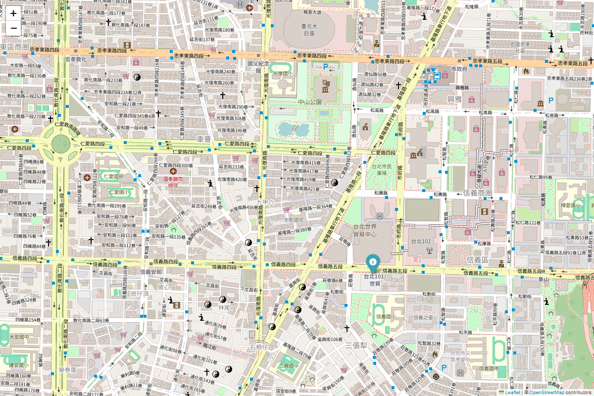

# Automated Map and GIF Generator



This project monitors a CSV file for changes and automatically generates an HTML map and an animated GIF.

## Requirements

- Python 3.6 or higher
- Google Chrome browser
- ChromeDriver

## Setup Instructions

### 1. Clone the Repository

Clone the repository to your local machine:
```
git clone https://github.com/your-username/your-repo.git
cd your-repo
```

### 2. Install Necessary Libraries

Ensure you have Python and pip installed. Then, install the required libraries by running:
```
pip install folium pillow selenium watchdog pandas webdriver-manager
```

### 3. Download ChromeDriver

Download ChromeDriver from [here](https://sites.google.com/chromium.org/driver/) and place it in a directory included in your system's PATH. Ensure the ChromeDriver version matches your installed version of Google Chrome. For more detailed setup instructions, please refer to the following two links:
- [Setup ChromeDriver on Windows](https://medium.com/marketingdatascience/selenium%E6%95%99%E5%AD%B8-%E4%B8%80-%E5%A6%82%E4%BD%95%E4%BD%BF%E7%94%A8webdriver-send-keys-988816ce9bed)
- [Adding Driver Path to Windows System PATH](https://www.uj5u.com/qianduan/162248.html)


### 4. Prepare the CSV File

You can start with an empty CSV file, an existing file with no data, or a file with data. The script will handle these cases and ensure the CSV file has the required columns (`latitude`, `longitude`, `timestamp`).

- **Empty CSV File**: If the CSV file does not exist, the script will create it with the required columns.
- **Existing File with No Data**: If the CSV file exists but is empty, the script will add the required columns.
- **File with Data**: You can also start with a CSV file that already contains data in the following format:

```
latitude,longitude,timestamp
37.7749,-122.4194,2024-01-01 08:00:00
34.0522,-118.2437,2024-01-01 14:00:00
40.7128,-74.0060,2024-01-02 09:00:00
41.8781,-87.6298,2024-01-02 16:00:00
29.7604,-95.3698,2024-01-03 10:00:00
```

Please note that the csv file name should be `locations.csv`.

### 5. Run the Script

Run the script to start monitoring the CSV file and generate the map and GIF:

```
python map_generator.py
```

### 6. Modify the CSV File

Open `locations.csv` in EXCEL or a text editor and make changes such as adding new rows or updating existing ones. Save the file after making changes. The script will automatically detect the changes and regenerate the map and GIF. There will be two output files - animation.gif and map.html.